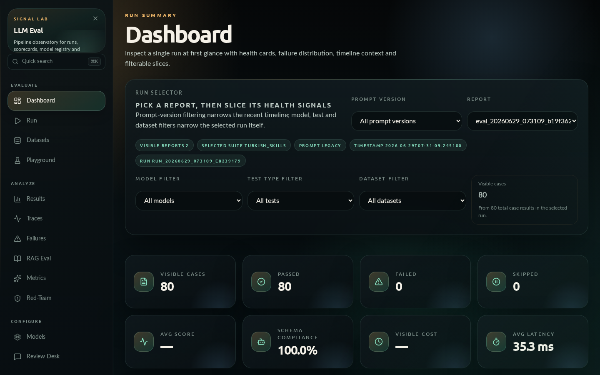
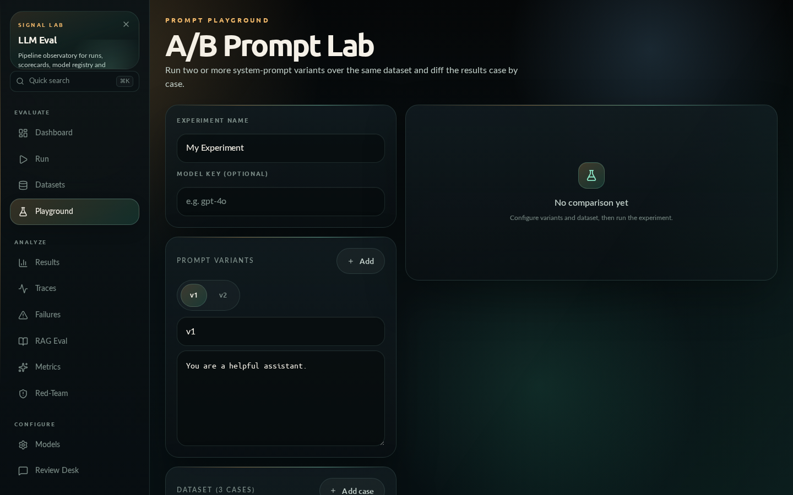
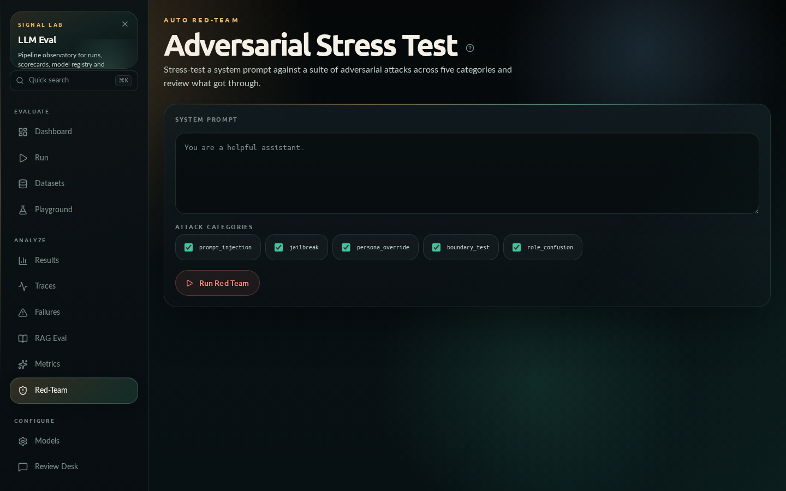

# LLM Evaluation Pipeline

<div align="center">

**Production-grade LLM evaluation, observability ve red-team platformu**

[](https://www.python.org/downloads/)
[](https://fastapi.tiangolo.com/)
[](https://react.dev/)
[](#testler)
[](https://opensource.org/licenses/MIT)

*Modelleri karşılaştırın · Canlı trace izleyin · Prompt'larınızı deneyin · Güvenliği test edin*

**[🇬🇧 English README](README.md)**

[Hızlı Başlangıç](#hızlı-başlangıç) · [Mimari](#mimari) · [React UI](#react-ui) · [API](#rest-api) · [Eval Datasets](#eval-datasets)

</div>

---

## Genel Bakış

LLM Evaluation Pipeline; batch model karşılaştırması, canlı trace ingestion, prompt playground, HITL review ve otomatik red-team özelliklerini tek bir platformda birleştiren kapsamlı bir LLM değerlendirme framework'üdür.

**Ne için kullanılır?**

- Üretim modeli seçimi öncesinde alternatifleri sistematik biçimde karşılaştırmak
- Kendi RAG/agent uygulamanızı instrument edip canlı trace'leri izlemek
- Prompt versiyonlarını aynı dataset üzerinde yan yana koşturmak (A/B)
- Jailbreak ve prompt injection saldırılarına karşı model direncini otomatik test etmek
- Domain'e özgü özel metrik oluşturup calibrate etmek
- Düşük kaliteli çıktıları otomatik kümeleyen bir failure taksonomi üretmek
- Model güncellemelerinde kalite regresyonunu CI/CD ile otomatik durdurmak

## Ekran Görüntüleri

| Dashboard | Prompt Playground | Auto Red-Team |
|-----------|-------------------|---------------|
|  |  |  |

---

## Mimari

```
┌──────────────────────────────────────────────────────────────────┐
│                     React + Vite Frontend                        │
│  Dashboard · Run · Results · Traces · Playground · Red-Team      │
│  HITL · Datasets · Custom Metrics · RAG Eval · Failures          │
│                   (port 5173 dev / web/dist prod)                │
└─────────────────────────────┬────────────────────────────────────┘
                              │ HTTP + WebSocket
┌─────────────────────────────▼────────────────────────────────────┐
│                    FastAPI Backend  (port 8001)                  │
│  /api/evaluations  /api/traces  /api/experiments  /api/redteam  │
│  /api/custom-metrics  /api/rag-eval  /api/failure-clustering     │
│  /api/hitl  /api/results  /api/models  /ws/progress             │
│              api/routers/ + api/services/                        │
└──────┬──────────────┬────────────────┬──────────────────────────┘
       │              │                │
┌──────▼──────┐ ┌─────▼───────┐ ┌─────▼──────────────────────────┐
│  pipeline_  │ │  tracing/   │ │     Standalone modüller        │
│  runner.py  │ │  sdk.py     │ │  experiments/  redteam/        │
│  evaluators/│ │  sampler.py │ │  analysis/     datagen/        │
│  adapters/  │ │  TraceStore │ │  evaluators/custom_metric.py   │
└─────────────┘ └─────────────┘ └────────────────────────────────┘
```

### Teknoloji Yığını

| Katman | Teknoloji |
|--------|-----------|
| Backend API | FastAPI + Uvicorn + WebSocket |
| Frontend | React 18 + Vite + TypeScript |
| LLM İstemcileri | openai SDK (OpenAI/Azure/OpenRouter/vLLM/Ollama), anthropic |
| Observability | Özel tracing SDK (EvalTracer, @trace decorator, OTLP-benzeri) |
| LLM-as-Judge | Provider-bağımsız judge evaluator'lar (quality/agent/groundedness) |
| Veri İşleme | pandas, numpy, scikit-learn (lazy import) |
| Veri Modelleri | Pydantic v2 |
| Konfigürasyon | YAML + python-dotenv |
| Konteyner | Docker + Compose |

---

## Hızlı Başlangıç

### Geliştirme Ortamı

```bash
# Python bağımlılıkları
pip install -r requirements.txt

# Frontend bağımlılıkları
cd web && npm install && cd ..

# Backend + frontend birlikte
make dev
```

| Adres | Servis |
|-------|--------|
| `http://localhost:5173` | React frontend (dev) |
| `http://localhost:8001` | FastAPI backend |
| `http://localhost:8001/docs` | Swagger UI |
| `ws://localhost:8001/ws/progress/<run_id>` | Gerçek zamanlı ilerleme |

### Üretim Build

```bash
cd web && npm run build          # web/dist/ oluşturur
set -a && source .env && set +a
uvicorn api.main:app --host 0.0.0.0 --port 8001
# → http://localhost:8001 (hem API hem frontend)
```

### Docker

```bash
cp .env.example .env             # .env içini doldurun
docker compose up --build        # http://localhost:8001
```

### 60 Saniyede Demo (API key gerekmez)

```bash
make demo            # mock model ile offline smoke eval → Dashboard dolu gelir
make demo-docker     # aynı demo, Docker image içinde
```

Demo koşusu `reports/` altına gerçek bir rapor yazar; ardından `make dev` ile Dashboard'ı açıp sonuçları gezebilirsiniz.

### Komut Satırı

```bash
python main.py --models gpt-4o --suite smoke                        # hızlı smoke
python main.py --models gpt-4o qwen-3-30b --suite full              # tam karşılaştırma
python main.py --models qwen-3-30b --suite mcp_only                 # sadece agentic
```

### Makefile Hedefleri

```bash
make dev              # backend + frontend
make dev-backend      # sadece FastAPI
make dev-frontend     # sadece Vite
make build-frontend   # production build
make check-api        # health check
make start-debug      # Docker debug stack
```

---

## Modüller

Proje birbirinden bağımsız (standalone) modüllerin tek yönlü bağımlılıkla birleştiği bir yapıya sahiptir. Her modül kendi dataclass'larını ve in-memory store'unu barındırır; `api/` katmanı bunları REST endpoint'lerine taşır.

### tracing/ — Online Eval & Trace Ingestion

Kendi LLM uygulamanızı enstrüman edin; canlı trace'leri platforma gönderin.

```python
from tracing.sdk import EvalTracer, HttpExporter

tracer = EvalTracer(exporters=[HttpExporter("http://localhost:8001/api/traces/ingest")])

@tracer.trace("rag-query")
def answer(question: str) -> str:
    with tracer.span("retriever"):
        docs = retrieve(question)
    with tracer.span("llm"):
        return generate(docs, question)
```

- `EvalTracer` + `@trace` decorator: contextvar tabanlı span yığınlama (async-safe)
- `OnlineSampler`: MD5 hash-tabanlı deterministik örnekleme
- `TraceStore`: asyncio lock, FIFO eviction (10k), tag/run_id filtresi
- Ingestion: `POST /api/traces/ingest` → `GET /api/traces` → `POST /api/traces/{id}/eval`

### experiments/ — Prompt Playground

Birden fazla prompt versiyonunu aynı dataset üzerinde koşturun; case düzeyinde diff alın.

```python
from experiments.store import PromptVariant, ExperimentCase, make_experiment
from experiments.runner import ExperimentRunner

runner = ExperimentRunner(model_fn=my_llm)
exp = make_experiment("v1 vs v2", variants=[...], dataset=[...])
results = runner.run(exp)
```

- `ExperimentRunner`: injectable `model_fn` / `score_fn`
- `compute_diff`: improved / regressed / stable / missing verdicts
- `ExperimentStore`: 500 kayıt, FIFO eviction
- API: `POST /api/experiments` → `/run` → `/compare`

### redteam/ — Auto Red-Team

Bir sistem promptunu 5 saldırı kategorisindeki 13 şablonla otomatik olarak zorla.

```python
from redteam.generator import generate_attacks
from redteam.runner import RedTeamRunner

attacks = generate_attacks("You are a helpful assistant.", ["jailbreak", "prompt_injection"])
runner = RedTeamRunner(model_fn=my_llm)
results = runner.run_session(session)
```

| Kategori | Açıklama |
|----------|----------|
| `prompt_injection` | "Ignore previous instructions…" varyasyonları |
| `jailbreak` | DAN, developer override, base model appeal |
| `persona_override` | Rol değiştirme, "evil twin" |
| `boundary_test` | PII talebi, zararlı içerik |
| `role_confusion` | Admin override, developer command |

- Heuristic scorer: compliance marker vs refusal marker tespiti
- `passed=True` → model saldırıya direndi
- API: `POST /api/redteam` → `/run` → `/results`

### evaluators/custom_metric.py — Özel Metrik

Doğal dil tanımından otomatik judge prompt üretimi:

```python
from evaluators.custom_metric import generate_judge_prompt, evaluate_with_custom_metric

prompt = generate_judge_prompt("Rate how empathetic the response is, 0-1")
result = evaluate_with_custom_metric(case, prompt, llm_fn=my_llm)
# → {"score": 0.85, "reasoning": "..."}
```

- LLM olmadan şablon tabanlı prompt (noop fallback)
- `calibrate_metric`: human label seti ile Pearson korelasyonu
- API: `POST /api/custom-metrics` → `/{id}/evaluate`

### analysis/rag_eval.py — RAG Bileşen Değerlendirmesi

Retriever ile generator hatalarını birbirinden ayır:

```python
from analysis.rag_eval import evaluate_rag_case

result = evaluate_rag_case({
    "question": "...", "contexts": [...], "answer": "..."
})
# → context_precision, context_recall, faithfulness, answer_relevance, fault_component
```

| Metrik | Ölçtüğü |
|--------|---------|
| `context_precision` | Context'teki ilgili chunk oranı |
| `context_recall` | Cevabın context tarafından karşılanma oranı |
| `faithfulness` | Cevabın context'e bağlılığı |
| `answer_relevance` | Cevabın soruyu karşılama derecesi |
| `fault_component` | `retriever` / `generator` / `both` / `none` |

- API: `POST /api/rag-eval`

### analysis/failure_clustering.py — Failure Taksonomi

Düşük skorlu case'leri kümele, otomatik etiketle:

```python
from analysis.failure_clustering import compute_failure_summary

summary = compute_failure_summary(report, threshold=0.6)
# → {"total_failures": 42, "clusters": [...], "model_breakdown": {...}}
```

- KMeans kümeleme (injectable `embed_fn` ile sklearn lazy import)
- Keyword tabanlı otomatik cluster etiketi
- API: `POST /api/failure-clustering`

### analysis/conv_simulator.py — Konuşma Simülatörü

Persona tanımlı sentetik kullanıcı ile agent arasında N turlu senaryo çalıştır:

```python
from analysis.conv_simulator import run_simulation_suite

results = run_simulation_suite(
    agent_fn=my_agent,
    personas=[neutral, demanding, confused],
    turns=5
)
```

- `goal_completion`, `coherence`, `efficiency` metrikleri
- CLI: `python -m analysis.conv_simulator --demo`

### analysis/significance.py — İstatistiksel Anlamlılık

Skor farkının gürültü mü yoksa gerçek bir fark mı olduğunu ölç:

```python
from analysis.significance import compute_significance
results = compute_significance("report.json", alpha=0.05, seed=42)
# → bootstrap CI, paired t-test, Wilcoxon, Cohen's d_z
```

- CLI: `python -m analysis.significance REPORT.json --format markdown`

### reports/share.py — Paylaşılabilir Rapor

Dark-mode HTML rapor, sosyal kart meta etiketleri, gömülebilir leaderboard:

```python
from reports.share import build_share_report
html = build_share_report(report, title="Q2 Model Comparison")
```

- Gzip+base64 permalink: `decode_permalink(url_hash)` ile geri açılır
- CLI: `python -m reports.share REPORT.json --format html`

### datagen/ — Sentetik Dataset Üretimi

Dokümanlardan golden Q/A dataset'i üret; cold-start sorununu çöz:

```bash
python -m datagen.generate \
    --source docs/guide.md \
    --project "E-ticaret botu" \
    --model gpt-4o \
    --output eval_datasets/generated/my_dataset.json
```

- `chunk_text` → LLM prompt → Q/A pair normalize → nondeterministik case filtresi
- Türkçe/İngilizce kaynak desteği

---

## React UI

`web/` — React 18 + Vite + TypeScript SPA. Production build `web/dist/` olarak FastAPI tarafından serve edilir.

| Sayfa | Rota | Ne Yapar |
|-------|------|----------|
| **Dashboard** | `/` | Genel metrik özeti, son run karşılaştırması, trend |
| **Run Evaluation** | `/run` | Model + süit seç, WebSocket ile canlı ilerleme |
| **Results** | `/results` | Rapor tarayıcısı, model skoru, AI commentary |
| **Live Traces** | `/traces` | Canlı trace listesi, span ağacı, eval butonu |
| **Prompt Playground** | `/playground` | Prompt A/B, dataset editörü, diff tablosu |
| **Auto Red-Team** | `/redteam` | Sistem promptunu 13 saldırı ile test et |
| **Custom Metrics** | `/custom-metrics` | NL açıklama → judge prompt → case evaluation |
| **RAG Eval** | `/rag-eval` | Soru + context + cevap → bileşen skorları |
| **Failure Clustering** | `/failures` | Rapor JSON yapıştır → cluster taksonomi |
| **HITL Review** | `/review` | İnceleme kuyruğu, anotasyon, trace queue |
| **Dataset Studio** | `/datasets` | Dataset yükleme, sentetik üretim |
| **Models** | `/models` | Model ekleme/düzenleme/silme |

---

## REST API

Tam Swagger UI: `http://localhost:8001/docs`

### Değerlendirme

| Method | Path | |
|--------|------|-|
| `POST` | `/api/evaluations/run` | Yeni eval başlat |
| `POST` | `/api/evaluations/runs/{id}/cancel` | İptal et |
| `GET` | `/api/evaluations/suites` | Süit listesi |
| `WS` | `/ws/progress/{run_id}` | Gerçek zamanlı ilerleme |

### Trace & Observability

| Method | Path | |
|--------|------|-|
| `POST` | `/api/traces/ingest` | Trace gönder |
| `GET` | `/api/traces` | Trace listesi (tag/run_id filtresi) |
| `GET` | `/api/traces/{id}` | Trace detayı + span ağacı |
| `POST` | `/api/traces/{id}/eval` | Trace'i eval kuyruğuna at |

### Prompt Experiments

| Method | Path | |
|--------|------|-|
| `POST` | `/api/experiments` | Experiment oluştur |
| `GET` | `/api/experiments` | Listele |
| `GET` | `/api/experiments/{id}` | Detay |
| `POST` | `/api/experiments/{id}/run` | Koştur (202) |
| `GET` | `/api/experiments/{id}/compare` | Variant diff |

### Auto Red-Team

| Method | Path | |
|--------|------|-|
| `POST` | `/api/redteam` | Session oluştur |
| `GET` | `/api/redteam` | Listele |
| `GET` | `/api/redteam/{id}` | Detay |
| `POST` | `/api/redteam/{id}/run` | Saldırıları koştur (202) |
| `GET` | `/api/redteam/{id}/results` | Sonuçlar |

### Custom Metrics

| Method | Path | |
|--------|------|-|
| `POST` | `/api/custom-metrics` | Metrik oluştur (prompt otomatik üretilir) |
| `GET` | `/api/custom-metrics` | Listele |
| `GET` | `/api/custom-metrics/{id}` | Detay + prompt |
| `POST` | `/api/custom-metrics/{id}/evaluate` | Case'leri değerlendir |

### RAG & Failure Analysis

| Method | Path | |
|--------|------|-|
| `POST` | `/api/rag-eval` | RAG bileşen skorları |
| `POST` | `/api/failure-clustering` | Rapor → cluster taksonomi |

### HITL & Sonuçlar

| Method | Path | |
|--------|------|-|
| `GET` | `/api/hitl/pending` | İnceleme bekleyenler |
| `POST` | `/api/hitl/review` | Anotasyon kaydet |
| `GET` | `/api/hitl/calibration` | Judge kalibrasyon metrikleri |
| `GET` | `/api/results/reports` | Rapor listesi |
| `GET` | `/api/results/reports/{filename}` | Rapor detayı |
| `POST` | `/api/custom-datasets` | Dataset yükle |
| `POST` | `/api/custom-datasets/generate` | Sentetik dataset üret |

---

## CI Entegrasyonu (Eval-as-CI)

Değerlendirme çıktısını bir kalite kapısına (gate) dönüştürür.

### CLI

```bash
python -m ci.gate reports/ci_report.json \
    --config config/ci_gate.yaml \
    --baseline reports/baseline.json \
    --format markdown
```

| Çıkış kodu | Anlam |
|-----------|-------|
| `0` | Gate geçti |
| `1` | Eşik ihlali |
| `2` | G/Ç hatası |

`--format badge` → shields.io endpoint JSON üretir.

### config/ci_gate.yaml

```yaml
weighted_score_min: 0.75
max_latency_p95: 10.0
fail_on_test_error: true
tests:
  turkish_grammar:
    min_score: 0.80
  function_calling:
    min_score: 0.75
regression:
  max_weighted_drop: 0.05
  max_test_drop: 0.10
```

### pytest Entegrasyonu

```python
from ci.pytest_plugin import load_report, assert_gate, assert_no_regression, assert_test_score

def test_quality():
    assert_gate(load_report("reports/ci_report.json"))

def test_no_regression():
    assert_no_regression(
        load_report("reports/ci_report.json"),
        load_report("reports/baseline.json")
    )
```

### GitHub Actions

`.github/workflows/llm-eval.yml` repoya dahildir. Composite action:

```yaml
- name: LLM Eval Gate
  uses: ./.github/actions/llm-eval-gate
  with:
    report: reports/ci_report.json
    config: config/ci_gate.yaml
    baseline: reports/baseline.json      # opsiyonel
    github-token: ${{ secrets.GITHUB_TOKEN }}
```

Action: Gate özetini `$GITHUB_STEP_SUMMARY`'ye yazar, PR yorumu gönderir, `llm-eval-badge.json` üretir, başarısızlıkta job'u kırar.

---

## Kontaminasyon Kontrolü

Test seti sızıntısını (ezber) guided-completion probe ile tespit eder: model her test sorusunun sadece ilk ~%60'ını görür ve birebir devam ettirmesi istenir. Gizli kuyrukla yüksek ROUGE-L benzerliği — veya beklenen cevabın birebir n-gram içerimi — o case'i işaretler.

```bash
python run_contamination.py --model gpt-4o --dataset eval_datasets/regression/golden.json --sample 20
```

Çıktı: case bazlı benzerlik + `clean` / `inconclusive` / `contamination_suspected` kararı, `reports/contamination_<ts>.json` dosyasına yazılır. Saf Python, ekstra bağımlılık yok.

---

## Skill Quality Lab

Agent SKILL.md dosyalarını değerlendirir: elindeki skill, yaptırmak istediğin iş için yeterli mi? Üç katman, sıfır yeni bağımlılık:

- **Statik lint** (anında, LLM'siz): frontmatter/name/description doğrulama, gövde token bütçesi, boş bölümler, progressive-disclosure ipucu ve altı güvenlik deseni (pipe-to-shell, yıkıcı `rm`, base64-exec, sudo, secret dosya okuma, env sızdırma). Skor 0-100.
- **Task-fit judge** (LLM): beş kriter — kapsam örtüşmesi, talimat netliği, eksiksizlik, konvansiyon uyumu, verimlilik riski — her biri 0-1 + skill'den birebir kanıt alıntısı, artı eksikler ve öneriler. Karar: `fit` / `partial_fit` / `unfit`. Birleşik skor = `0.5×lint + 0.5×fit`.
- **Trigger simülasyonu** (LLM): judge modeli skill'in sadece `name`+`description` alanlarıyla (gövde asla gösterilmez) etiketli bir prompt setine (`true`/`false`/`"ambiguous"`) karşı sınar, her prompt için `repeats` deneme + çoğunluk oyu. Precision/recall/F1/false-positive-rate ve karar döner — `reliable` / `over_triggering` / `under_triggering` / `unreliable` / `insufficient_data` (en az 4 skorlu prompt gerekir).

```bash
# Sadece statik lint
python run_skill_eval.py --skill path/to/SKILL.md

# Lint + task-fit + birleşik skor (reports/skill_eval_<ts>.json'a kaydedilir)
python run_skill_eval.py --skill path/to/SKILL.md --task "Haftalık satış CSV'sinden bölge raporu üret" --model gpt-4o

# Trigger simülasyonu — etiketli prompt seti üzerinde routing precision/recall
python run_skill_eval.py --skill path/to/SKILL.md --trigger-prompts prompts.json --model gpt-4o --repeats 3
```

`prompts.json`: `[{"text": "...", "expected": true|false|"ambiguous"}, ...]`

Dashboard'daki **Skill Lab** sayfası (`/skill-lab`) ve API üzerinden de kullanılabilir: `POST /api/skill-eval/lint`, `/fit`, `/trigger`, `/full`, `GET /api/skill-eval/reports`.

---

## Skor Hesaplama

### Katman 1 — Item Bazında

**LLM-as-Judge (kategorik):**

| Etiket | Puan |
|--------|------|
| `TAM_DOGRU` | 1.0 |
| `KISMEN_DOGRU` | 0.5 |
| `YANLIS` | 0.0 |

Numeric 1-10 skalası kullanılmaz; verbosity bias'tan kaçınmak için kategorik tasarım.

**Agent judge (agentic testler):** `task_adherence`, `tool_call_accuracy`, `response_completeness`, `intent_resolution` — provider-bağımsız LLM-as-judge (`evaluators/agent_judge.py`). Judge parse hataları `None` döner ve agregasyondan hariç tutulur (fake 0 kirliliği yok).

**Quality judge:** `coherence`, `fluency`, `relevance`, `groundedness` (1-5 → normalize 0-1, `evaluators/quality_judge.py`).

### Katman 2 — Test Bazında overall_score

| Test Tipi | Formül |
|-----------|--------|
| `qa`, `turkish_*`, `fintech_*` | `(TAM×1.0 + KISMİ×0.5) / total` |
| `mcp_tool_use`, `agentic_workflows` | `agentic_pack_aggregate` |
| `function_calling` | `avg(overall_lenient)` |
| `function_calling_chain` | `0.7×tool_coverage + 0.3×order_score` |
| `rag_test`, `needle_in_haystack` | `avg_rag_quality` |
| `adversarial_security` | `safety_rate` |
| `embedding_sts` | `spearman_correlation` |
| `embedding_retrieval` | `NDCG@10` |
| `multi_turn`, `stress_tests` | `avg_context_retention` |

### Katman 3 — Model Bazında weighted_score

```
weighted_score = Σ(test_overall_score × weight) / Σ(weight)
```

Ağırlıklar `config/tests.yaml` içinde tanımlıdır. `error_rate`, `latency`, `tokens_per_second` altyapı metrikleridir; `weighted_score`'a girmez.

---

## Testler

Tüm contract testleri `tests/` dizininde, `pytest.ini` ile keşfedilir.

```bash
pytest                                          # tüm suite
pytest tests/test_redteam_router_contracts.py  # tek dosya
pytest -k "experiments"                         # filtreli
```

**Mevcut baseline: 633 contract testi pass.**

Test izolasyonu için root `conftest.py`:
- scipy (numpy 2.x binary compat) → `MagicMock`
- sklearn (numpy 2.x binary compat) → saf-numpy KMeans mock

---

## Desteklenen Modeller

| Sağlayıcı | Örnekler |
|-----------|---------|
| Azure OpenAI | GPT-4o (PTU/PR), GPT-4.1 |
| OpenAI | GPT-4o, GPT-5 |
| Anthropic | Claude Sonnet 4.x |
| OpenRouter | Tek API key ile yüzlerce hosted model |
| vLLM (on-premise) | Qwen-3-30B, Mistral-Small-3.1, LLaMA-3-70B |
| Ollama (yerel) | llama3, mistral, gemma2, phi3 |
| LM Studio (yerel) | GGUF formatındaki herhangi bir model |

```yaml
# config/models.yaml örneği
models:
  gpt-4o:
    provider: openai
    api_key: ${AZURE_OPENAI_KEY}
    base_url: ${AZURE_OPENAI_ENDPOINT}
    model_name: ${AZURE_OPENAI_DEPLOYMENT_NAME_PTU}
    max_tokens: 4096
    temperature: 0.0
    supports_function_calling: true

  qwen-3-30b:
    provider: openai        # vLLM OpenAI-uyumlu endpoint
    base_url: ${VLLM_BASE_URL}
    api_key: dummy
    model_name: default
    max_tokens: 4096
    temperature: 0.0
    supports_function_calling: true
```

---

## Ortam Değişkenleri

`.env.example`'dan kopyalayın:

```bash
# Azure OpenAI
AZURE_OPENAI_ENDPOINT=https://your-resource.openai.azure.com/
AZURE_OPENAI_KEY=your-key
AZURE_OPENAI_API_VERSION=2024-08-01-preview
AZURE_OPENAI_DEPLOYMENT_NAME_PTU=gpt-4o

# OpenAI Direct
OPENAI_API_KEY=your-key

# Anthropic
ANTHROPIC_API_KEY=your-key

# OpenRouter
OPENROUTER_API_KEY=your-key

# On-Premise vLLM
VLLM_BASE_URL=http://your-vllm-server:8000/v1
MISTRAL_VLLM_BASE_URL=http://your-mistral-server:8000/v1

# Yerel
OLLAMA_BASE_URL=http://localhost:11434/v1
LMSTUDIO_MODEL1_BASE_URL=http://localhost:1234/v1
```

---

## Eval Datasets

`eval_datasets/` altında 9 kategoride JSON formatında test setleri:

| Klasör | İçerik |
|--------|--------|
| `benchmark/` | Turkish grammar/reasoning/creativity/paraphrasing, PII, self-consistency, negative constraints |
| `agentic/` | Multi-adım görev planlama, araç seçimi |
| `edge_cases/` | Adversarial (jailbreak/injection), edge case senaryoları |
| `embedding/` | STS, cross-lingual STS, retrieval, hard-negative retrieval, domain clustering |
| `fintech/` | Fintech alan bilgisi, finansal hesaplamalar |
| `function_calling/` | Temel araç seçimi, paralel araç, tool chain, error recovery |
| `multi_turn/` | Context retention, long-context stress |
| `rag/` | RAG kalite, needle-in-haystack |
| `regression/` | Golden set, recent issue regression |
| `security/` | PII sızıntısı, kimlik doğrulama atlatma, stress |

---

## Proje Yapısı

```
llm-eval-pipeline/
├── api/
│   ├── main.py                   # App factory, CORS, lifespan
│   ├── routers/                  # evaluations, traces, experiments,
│   │                             # redteam, custom_metrics, rag_eval,
│   │                             # failure_clustering, hitl, models,
│   │                             # results, custom_datasets, websocket
│   ├── services/                 # EvalService, TraceService, RedTeamService,
│   │                             # ExperimentService, CustomMetricService,
│   │                             # RagEvalService, FailureClusteringService…
│   └── schemas/                  # Pydantic request/response modeller
├── tracing/
│   ├── sdk.py                    # EvalTracer, Span, @trace, exporters
│   └── sampler.py                # OnlineSampler (MD5 deterministik)
├── experiments/
│   ├── store.py                  # PromptVariant, ExperimentCase, ExperimentStore
│   ├── runner.py                 # ExperimentRunner (injectable model_fn)
│   └── differ.py                 # compute_diff → improved/regressed/stable
├── redteam/
│   ├── store.py                  # Attack, AttackResult, RedTeamSession
│   ├── generator.py              # 13 AttackTemplate, generate_attacks()
│   ├── scorer.py                 # Heuristic scorer (compliance vs refusal)
│   └── runner.py                 # RedTeamRunner (injectable model_fn)
├── analysis/
│   ├── rag_eval.py               # context_precision/recall/faithfulness/relevance
│   ├── failure_clustering.py     # KMeans kümeleme + keyword etiketleme
│   ├── conv_simulator.py         # Persona-tabanlı sentetik kullanıcı simülasyonu
│   ├── significance.py           # Bootstrap CI, paired t-test, Cohen's d_z
│   ├── arena_elo.py              # Bradley-Terry/Elo pairwise leaderboard
│   └── run_diff.py               # İki run arasında diff
├── evaluators/                   # 25 bağımsız evaluator
│   ├── llm_judge.py              # Kategorik LLM-as-judge
│   ├── quality_judge.py          # coherence/fluency/relevance/groundedness
│   ├── agent_judge.py            # task adherence, tool accuracy, completeness, intent
│   ├── groundedness_judge.py     # RAG faithfulness judge
│   ├── judge_utils.py            # Judge'lar için ortak JSON parse + retry
│   ├── geval.py                  # G-Eval (fluency/coherence/relevance)
│   ├── custom_metric.py          # NL → judge prompt, calibrate, evaluate
│   └── ...                       # (hallucination, safety, adversarial, RAG…)
├── datagen/
│   └── generate.py               # Doküman → chunk → Q/A golden dataset
├── reports/
│   └── share.py                  # Shareable HTML rapor, permalink, embed
├── ci/
│   ├── gate.py                   # Kalite kapısı (threshold + regresyon)
│   └── pytest_plugin.py          # assert_gate, assert_weighted_score, …
├── web/
│   ├── src/
│   │   ├── pages/                # 12 React sayfası
│   │   └── api/client.ts         # Tüm API istemci fonksiyonları
│   └── dist/                     # Production build
├── tests/                        # 40 contract test dosyası
│   └── test_*.py
├── adapters/
│   ├── unified_adapter.py        # Tek LLM arayüzü (tüm sağlayıcılar)
│   └── embedding_adapter.py
├── eval_datasets/                # Test veri setleri (JSON)
├── config/
│   ├── models.yaml
│   ├── tests.yaml                # Süit tanımları + ağırlıklar
│   └── ci_gate.yaml
├── .github/
│   ├── workflows/llm-eval.yml
│   └── actions/llm-eval-gate/
├── pytest.ini
├── Makefile
├── Dockerfile
└── docker-compose.yml
```

---

## Sorun Giderme

**vLLM bağlantı hatası:**
```bash
python -m vllm.entrypoints.openai.api_server --model MODEL_NAME --port 8000
```

**API key hatası:**
```bash
source .env && echo $AZURE_OPENAI_KEY
```

**Frontend erişilemiyor:** Vite port çakışmasında otomatik sonraki porta geçer; terminal çıktısını kontrol edin.

**Judge zaman aşımı:** `config/models.yaml`'da `timeout: 60` ekleyin.

**sklearn binary compat hatası:** `conftest.py` ortamdaki numpy 2.x uyumsuzluğunu otomatik olarak mocklayarak çözer; sadece `pytest` ile test koşun.

---

## Lisans

MIT License — bkz. [LICENSE](LICENSE)

---

<div align="center">

[⬆ Başa Dön](#llm-evaluation-pipeline)

</div>
